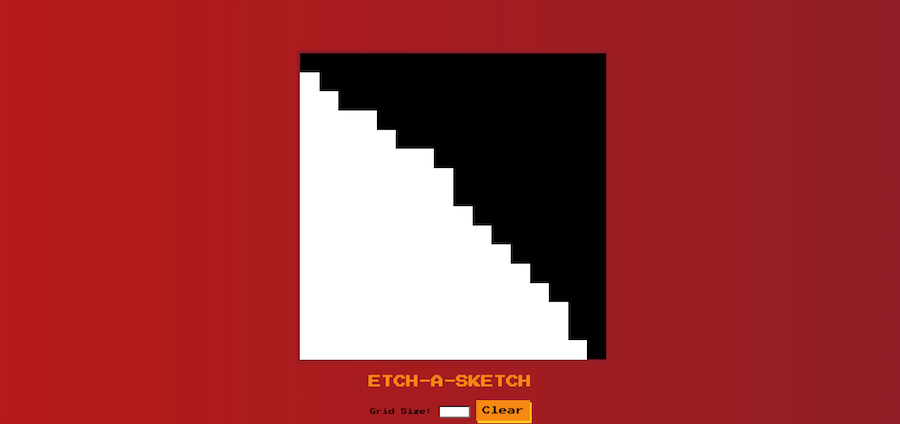

# Etch-A-Sketch

## Table of contents

- [Overview](#overview)
  - [Live Preview](#Live-preview)
  - [Screenshot](#screenshot)
- [My process](#my-process)
  - [Built with](#built-with)
  - [What I learned](#what-i-learned)
  - [Continued development](#continued-development)
  - [Acknowledgements](#acknowledgements)

## Overview

### Live preview

[Click Here](https://bhornbhaya.github.io/odin-etch-a-sketch/)

### Screenshot

### Desktop Version

## My process

### Built with

- HTML5
- CSS
- Javascript
- Sass
- CSS Grid

### What I learned

- How to plan a project
- How to reduce problems to smaller one and easy to tackle
- DOM and DOM Manipulation
- Selecting and manipulating elements
- Handling click events
- Manipulating CSS styles

### Continued development

- Allow user to change colors of the brush

### Acknowledgements

A challenge by [The Odin Project](https://www.theodinproject.com)

Coded by [me](https://www.linkedin.com/in/bhornbhaya/)
